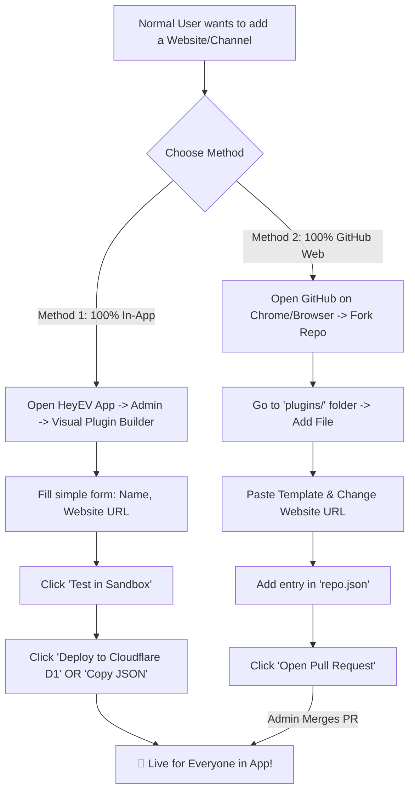

# 📖 HeyEV Plugins: Normal User Step-by-Step Creation & Deployment Guide
> **Ek aam user (Normal User) bina coding jane naya plugin kaise banaye aur GitHub par kaise upload/deploy kare?**

---

## 🎯 Summary Overview (Workflow Chart)



---

## 🚀 METHOD 1: HeyEV App se Banayein (Bina GitHub / Zero Coding)

Agar aapko Git ya GitHub chalana nahi aata, toh aap **HeyEV App ke andar hi 2 minute me plugin bana sakte hain**:

### Step 1: Plugin Creator Screen Kholein
1. HeyEV App open karein.
2. Profile ya Admin section me jayein $\rightarrow$ **Plugins & Extensions** par tap karein.
3. Top tabs me se **"Create Plugin" (Visual Generator)** par tap karein.

### Step 2: Form Fill Karein
Aapko bas aam jankari bharni hai:
* **Plugin Name**: Website ka naam (e.g. *BollyFlix Movies* ya *DD National Live*)
* **Plugin Type**:
  - `Website Scraper` $\rightarrow$ Agar movie/web series ki website hai
  - `Video Extractor` $\rightarrow$ Agar koi specific video streaming link solve karna hai
  - `IPTV Playlist` $\rightarrow$ Agar Live TV channels ki `.m3u` link hai
* **Base / Catalog URL**: Website ka main page (e.g. `https://bollyflix.com`)
* **Search Endpoint**: Search URL (e.g. `https://bollyflix.com/search/{query}`)
* **Categories**: Jaise `Bollywood, Hollywood, Web Series`

### Step 3: Test Karein (Sandbox Dry-Run)
* **"Test Plugin"** tab me jayein.
* Koi bhi movie ka naam ya URL daal kar check karein.
* App screen par dikha dega ki video play ho rahi hai ya nahi aur kitne milliseconds me response aaya.

### Step 4: 1-Click Deploy
* **"Deploy to Cloudflare D1"** button dabayein!
* Naya plugin turant poore app database me save ho jayega aur aapke library aur history me integrate ho jayega.

---

## 🌐 METHOD 2: GitHub Web Browser Se Deploy Karein (No Terminal, No Git Command)

Normal users ko terminal ya software install karne ki koi zaroorat nahi hai. Aap seedha **Chrome / Safari browser** se upload kar sakte hain:

### 📝 Step 1: Repository Fork Karein
1. Apne phone ya PC ke browser me ye link kholein:
   👉 **https://github.com/Rohanbania009/HeyEV-Plugins**
2. Top right me **"Fork"** button par click karein.
3. **"Create Fork"** dabayein. (Ab ye repo aapke apne GitHub account me copy ho gayi).

---

### 📝 Step 2: Nayi Plugin File Banayein (`plugins/`)
1. Apne forked repository me `plugins` folder par click karein.
2. Top right me **"Add file"** $\rightarrow$ **"Create new file"** par click karein.
3. File ka naam likhein:
   ```text
   mera_website_plugin.json
   ```
   *(Jaise: `vegamovies.json` ya `aajtak_live.json`)*

4. Niche diye gaye 3 Templates me se apna pasandeeda template copy karein aur box me paste karein:

---

#### 🎬 Template A: Movie / Video Website ke liye
```json
{
  "id": "com.user.mymovies",
  "name": "MyMovies Online",
  "version": "1.0.0",
  "author": "Aapka Naam",
  "type": "website_scraper",
  "description": "Latest Hindi and English movies & shows",
  "iconUrl": "https://mymovies.com/favicon.ico",
  "domainPatterns": ["mymovies.com", "mymovies.to"],
  "catalogEndpoint": "https://mymovies.com",
  "searchEndpoint": "https://mymovies.com/search?q={query}",
  "categories": ["Latest", "Action", "Hindi Dubbed", "Web Series"],
  "streamExtractionRegex": "(https?:\\/\\/[^\"'\\s]+\\.(?:mp4|m3u8))",
  "headers": {
    "User-Agent": "Mozilla/5.0 (Windows NT 10.0; Win64; x64) AppleWebKit/537.36"
  }
}
```

---

#### 📺 Template B: Live TV Channel (M3U / IPTV) ke liye
```json
{
  "id": "com.user.livetv",
  "name": "Hindi Live TV Channels",
  "version": "1.0.0",
  "author": "Aapka Naam",
  "type": "iptv_playlist",
  "description": "100+ Free Indian News and Entertainment Channels",
  "iconUrl": "https://cdn-icons-png.flaticon.com/512/3845/3845868.png",
  "domainPatterns": [],
  "catalogEndpoint": "https://raw.githubusercontent.com/iptv-org/iptv/master/streams/in.m3u",
  "categories": ["News", "Music", "Entertainment", "Sports"],
  "streamExtractionRegex": "",
  "headers": {}
}
```

---

#### ⚡ Template C: Direct Video Link Extractor ke liye
```json
{
  "id": "com.user.dailymotion",
  "name": "Dailymotion Streamer",
  "version": "1.0.0",
  "author": "Aapka Naam",
  "type": "video_extractor",
  "description": "Extracts direct HD video from Dailymotion links",
  "iconUrl": "https://www.dailymotion.com/favicon.ico",
  "domainPatterns": ["dailymotion.com", "dai.ly"],
  "streamExtractionRegex": "\"qualities\":\\s*\\{[^}]*\"auto\":\\[\\{\"type\":[^\"]*\"url\":\"([^\"]+)\"",
  "headers": {
    "Referer": "https://www.dailymotion.com"
  }
}
```

5. Green button **"Commit changes..."** par click karke save kar dein.

---

### 📝 Step 3: `repo.json` Me Apna Plugin List Karein
1. Wapas main folder par aayein aur `repo.json` file par click karein.
2. Pencil ✏️ icon (**Edit this file**) dabayein.
3. `"plugins": [` list ke andar ek naya entry comma (`,`) lagakar add kar dein:

```json
    {
      "id": "com.user.mymovies",
      "name": "MyMovies Online",
      "version": "1.0.0",
      "author": "Aapka Naam",
      "type": "website_scraper",
      "description": "Latest Hindi and English movies & shows",
      "iconUrl": "https://mymovies.com/favicon.ico",
      "downloadUrl": "https://raw.githubusercontent.com/AapkaUsername/HeyEV-Plugins/main/plugins/mera_website_plugin.json",
      "domainPatterns": ["mymovies.com"]
    }
```
4. **"Commit changes..."** par click karke save karein.

---

### 📝 Step 4: Pull Request (PR) Bhejein (Deploy Request)
1. Apne repo me upar **"Contribute"** button par click karein.
2. **"Open Pull Request"** par click karein.
3. Title likhein: `Add MyMovies plugin` aur **"Create pull request"** click karein.
4. **Bas ho gaya!** Jaise hi Admin PR approve karega, poori duniya me har HeyEV app user ke **Discover Store** me aapka plugin turant live ho jayega!

---

## ⚡ METHOD 3: Bina Admin Approval Ke Turant Dost Ke Sath Share Karna (Custom Import)

Aapko PR approve hone ka intezar bhi karne ki zaroorat nahi hai:
1. Apni JSON file ka GitHub **"Raw"** link copy karein.
   *(Jaise: `https://raw.githubusercontent.com/.../plugins/mera_website.json`)*
2. Apne dost ko link share karein.
3. Dost HeyEV App kholega $\rightarrow$ **Plugins & Extensions** $\rightarrow$ **[+] Import Custom Plugin** dabayega $\rightarrow$ Link paste karega.
4. Plugin turant install ho jayega aur chalne lagega!

---

## 🛡️ Database Aur Watch History Kaise Kaam Karega?

User ke liye sab kuch automatically connect rehta hai:
1. **Resume Playback**: Video pause karne par timeline record hoti hai aur app ke Home screen me "Continue Watching" me aa jaati hai.
2. **Save to Library**: Kisi bhi plugin video ke upar bane **Bookmark/Save** icon par tap karte hi wo user ke Cloudflare D1 account me permanently save ho jati hai.
3. **Albums & Tags**: Plugin se save kiye hue videos ko Albums me arrange kiya ja sakta hai.
