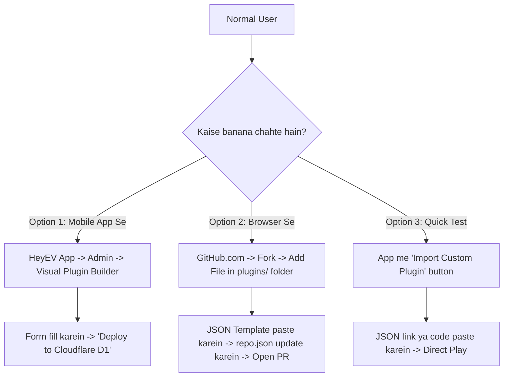

# 🧩 HeyEV Community Plugins & Extensions Repository

[](https://github.com/Rohanbania009/HeyEV-Plugins)
[](https://github.com/Rohanbania009/HeyEV-Plugins)
[](https://github.com/Rohanbania009/HeyEV-Plugins)

Yeh public Git repository **HeyEV Video Streaming App** ke dynamic plugins aur extensions ko host karne ke liye banayi gayi hai. Is system ki madad se koi bhi normal user ya developer **bina app ko modify/recompile kiye** naye websites, scrapers, video extractors, aur Live TV channels add kar sakta hai!

👉 **[📖 Click Here for Normal User Step-by-Step Guide (NORMAL_USER_GUIDE.md)](NORMAL_USER_GUIDE.md)**

---

## 🌟 Key Features of the Plugin System
- **⚡ 100% Modularity**: App ka jo default code aur features hain wo 100% untouched aur safe rehte hain.
- **🌐 Public Git Ecosystem**: GitHub par repo host hoti hai (`https://github.com/Rohanbania009/HeyEV-Plugins.git`), jahan se sabhi users Discover Store me install karte hain.
- **📺 Automatic In-App Integration**:
  - **Watch History**: Har video play hote hi app ke Watch History me save hota hai with live resume position!
  - **Cloudflare D1 Database**: Har media card par **Bookmark / Save to Library** button se Cloudflare database ("My Links") me sync hota hai.
  - **Integrated Video Player**: Subtitles, audio tracks, picture-in-picture (PiP), background playback, aur custom HTTP headers ke sath chalta hai.
  - **URL Interceptor**: "Play by URL" me plugin ka domain aane par plugin automatically background me media extract kar leta hai.

---

## 📁 Repository Structure

```text
HeyEV-Plugins/
├── repo.json                              <-- Master Repository Index Catalog (Store list)
├── NORMAL_USER_GUIDE.md                   <-- Normal User Step-by-Step creation & deploy guide
├── README.md                              <-- Technical Documentation & Specifications
└── plugins/
    ├── hdhub4u_provider.json             <-- HDHub4u Movies Scraper Plugin
    ├── livetv_india_provider.json        <-- Live TV India IPTV Plugin
    ├── dailymotion_provider.json         <-- Dailymotion Video Extractor Plugin
    ├── archiveorg_provider.json          <-- Internet Archive Media Plugin
    └── livetv_channels.m3u               <-- Live TV M3U Channels Playlist
```

---

## 🚀 Normal User Kaise Banayega Aur Deploy Karega?

Normal users ke paas **3 aasan raaste (options)** hain:



### 1️⃣ Option 1: HeyEV App ke Visual Builder Se (Zero Code)
1. HeyEV App kholein $\rightarrow$ **Plugins & Extensions** $\rightarrow$ **Create Plugin** tab.
2. Bas Website ka Name, Type (Movies, Extractor ya Live TV), aur URL enter karein.
3. **"Test in Sandbox"** button daba kar live check karein ki stream chal rahi hai ya nahi.
4. **"Deploy to Cloudflare D1"** par tap karein — turant app me save ho jayega!

### 2️⃣ Option 2: GitHub Web Browser Se (Bina Terminal ke)
1. Browser me **https://github.com/Rohanbania009/HeyEV-Plugins** kholein aur **Fork** dabayein.
2. `plugins/` folder ke andar **Add file $\rightarrow$ Create new file** karke template paste karein.
3. `repo.json` me apne plugin ka naam aur download URL jod dein.
4. **Contribute $\rightarrow$ Open Pull Request** dabayein.
5. Admin approve karte hi sabhi users ke Discover store me live dikhne lagega!

### 3️⃣ Option 3: Private Custom Import
Agar bina GitHub approval ke kisi friend ko plugin dena ho:
- Plugin JSON ka link friend ko send karein.
- Friend App ke **Plugins screen** par jakar **[+] Import Custom Plugin** me link paste karega aur instant chalne lagega.

---

## 📋 Ready-to-Use Plugin JSON Templates

### 🎬 Template 1: Movie / Series Website Scraper (`website_scraper`)
```json
{
  "id": "com.user.mymovies",
  "name": "MyMovies Online",
  "version": "1.0.0",
  "author": "Community Member",
  "type": "website_scraper",
  "description": "Stream latest movies and web series in HD",
  "iconUrl": "https://mymovies.com/favicon.ico",
  "domainPatterns": ["mymovies.com", "mymovies.to"],
  "catalogEndpoint": "https://mymovies.com",
  "searchEndpoint": "https://mymovies.com/search?q={query}",
  "categories": ["Action", "Drama", "Sci-Fi", "Comedy"],
  "streamExtractionRegex": "(https?:\\/\\/[^\"'\\s]+\\.(?:mp4|m3u8))",
  "headers": {
    "User-Agent": "Mozilla/5.0 (Windows NT 10.0; Win64; x64) AppleWebKit/537.36"
  }
}
```

---

### 📺 Template 2: Live TV / IPTV Channels (`iptv_playlist`)
```json
{
  "id": "com.user.livetv",
  "name": "India Live TV Channels",
  "version": "1.0.0",
  "author": "Community Member",
  "type": "iptv_playlist",
  "description": "Live News, Sports & Entertainment channels",
  "iconUrl": "https://cdn-icons-png.flaticon.com/512/3845/3845868.png",
  "domainPatterns": [],
  "catalogEndpoint": "https://raw.githubusercontent.com/iptv-org/iptv/master/streams/in.m3u",
  "categories": ["News", "Sports", "Music", "General"],
  "streamExtractionRegex": "",
  "headers": {}
}
```

---

### ⚡ Template 3: Video Extractor Link Resolver (`video_extractor`)
```json
{
  "id": "com.user.dailymotion",
  "name": "Dailymotion Extractor",
  "version": "1.0.0",
  "author": "Community Member",
  "type": "video_extractor",
  "description": "Resolves dailymotion.com URLs to direct streaming links",
  "iconUrl": "https://www.dailymotion.com/favicon.ico",
  "domainPatterns": ["dailymotion.com", "dai.ly"],
  "streamExtractionRegex": "\"qualities\":\\s*\\{[^}]*\"auto\":\\[\\{\"type\":[^\"]*\"url\":\"([^\"]+)\"",
  "headers": {
    "Referer": "https://www.dailymotion.com"
  }
}
```

---

## 🛠️ Super-Admin Controls (In-App Management)

App ke **Admin Panel $\rightarrow$ Plugins & Extensions** me superadmin ke paas complete moderation tools hain:
- 🛡️ **Verified Badge**: Safe & trusted community plugins ko Verified Blue Tick mark karein.
- ⭐ **Featured Pin**: Best plugins ko Store me sabse upar pin karein.
- 🚫 **Blacklist Killswitch**: Broken ya harmful plugins ko 1-tap me sabhi devices par block karein.
- 🧪 **Live Dry-Run Tester**: Plugin deploy karne se pehle actual streaming URL daal kar response time aur streams test karein.
- ☁️ **Cloudflare D1 Live Sync**: Settings aur custom plugins instant cloud database me sync hote hain.
